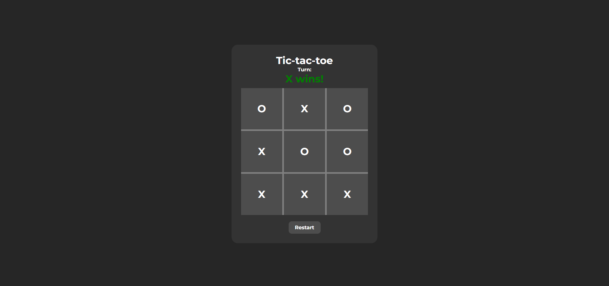
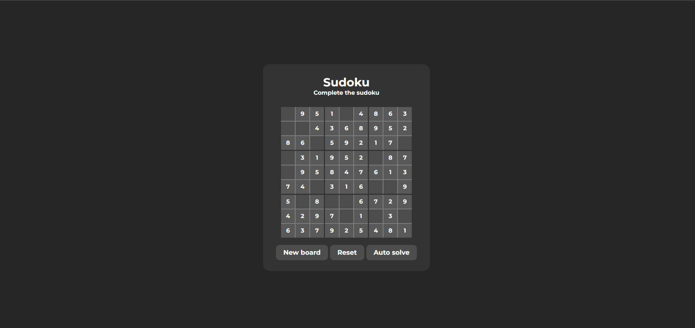
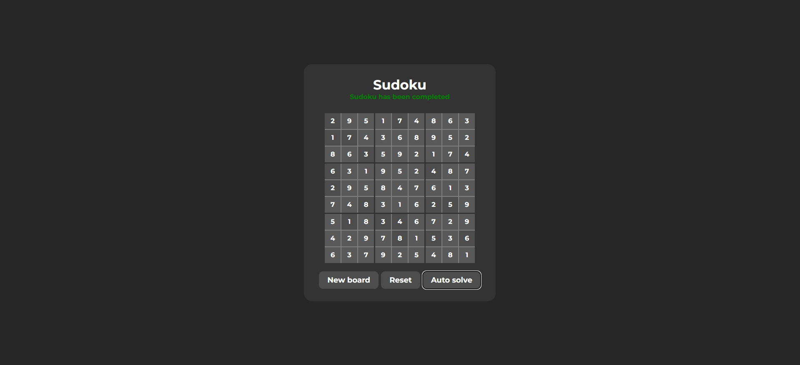

# JS-projects
To challenge myself I worked on some JavaScript projects. These projects are not really original, but I did made them without any reference or help. For each project I added a screenshot folder to see what the project looks like, without having to download.
#
Some screenshots (click on the image for a larger view):
 
 

 
 

 
 

 
 
