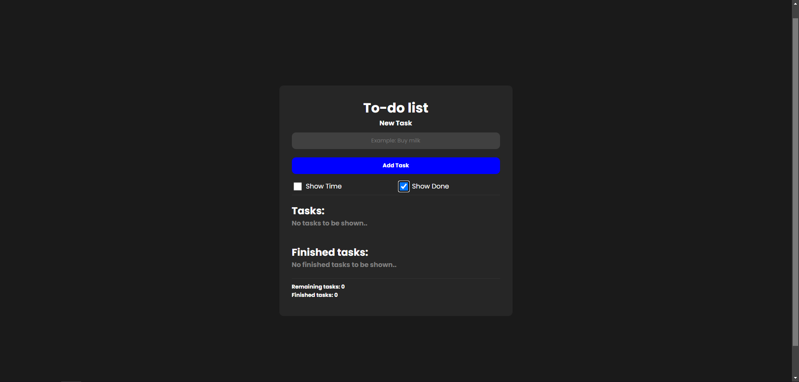
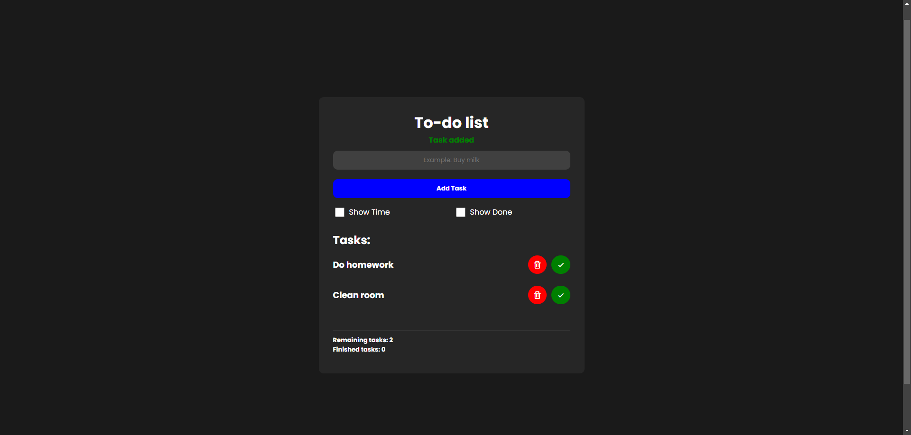
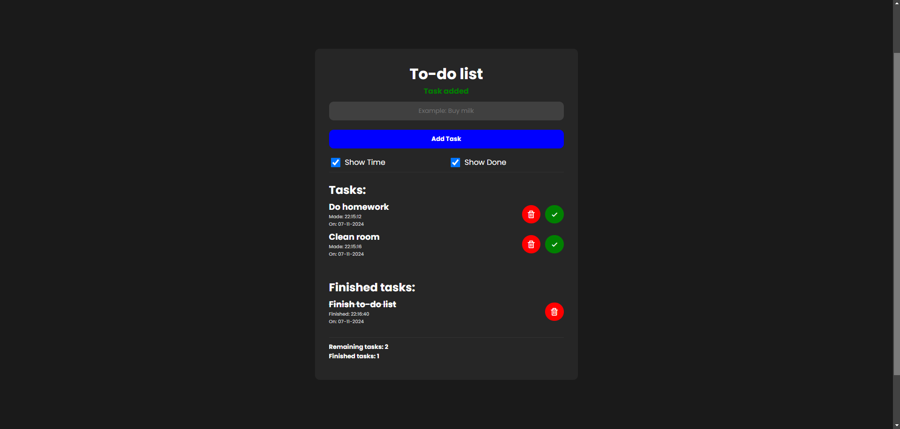
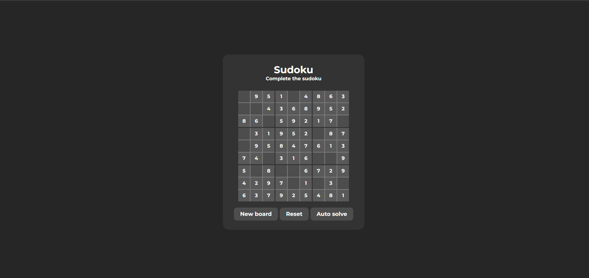
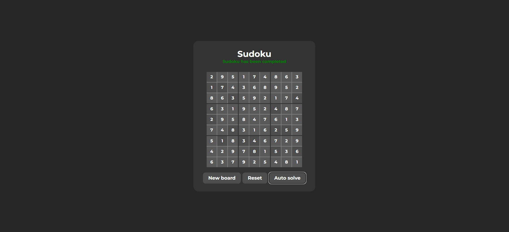

# JS-projects

To challenge myself, I worked on several JavaScript projects. While these projects aren't particularly original, I created them entirely on my own, without any references or external help. I included a screenshot folder, allowing you to preview the project without needing to download it. Currently, my projects include a To-Do List that utilizes LocalStorage to manage tasks and completed items, as well as a Sudoku game that employs a Backtracking algorithm to generate and solve boards.

#

Screenshots (click on the image for a larger view):
 
 

 
 

 
 

 
 

 
 

 
 
